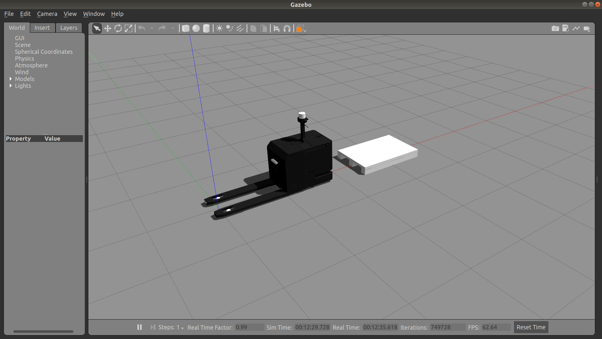

# rbares_sim

Packages for the simulation of the RB Ares.



## Packages

### rbares_sim_bringup

Launch files that launch the complete simulation of the robot.

### rbares_gazebo

Launch files and world files to start the simulation in Gazebo. Should not be used directly but throught the `rbares_sim_bringup` package, unless you want to do something non-standard.

### Bringup

Launch sample simulation with:

```
roslaunch rbares_sim_bringup rbares_complete.launch
```

For further info see [rbares_sim_bringup](rbares_sim_bringup/README.md)
